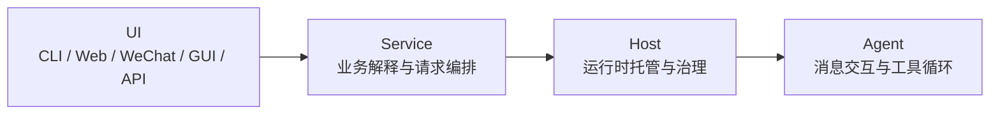
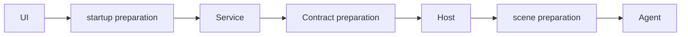
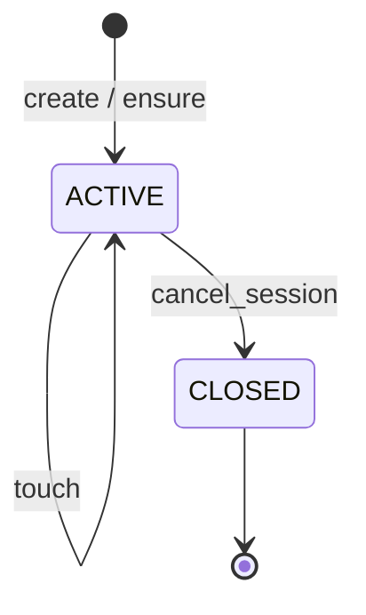
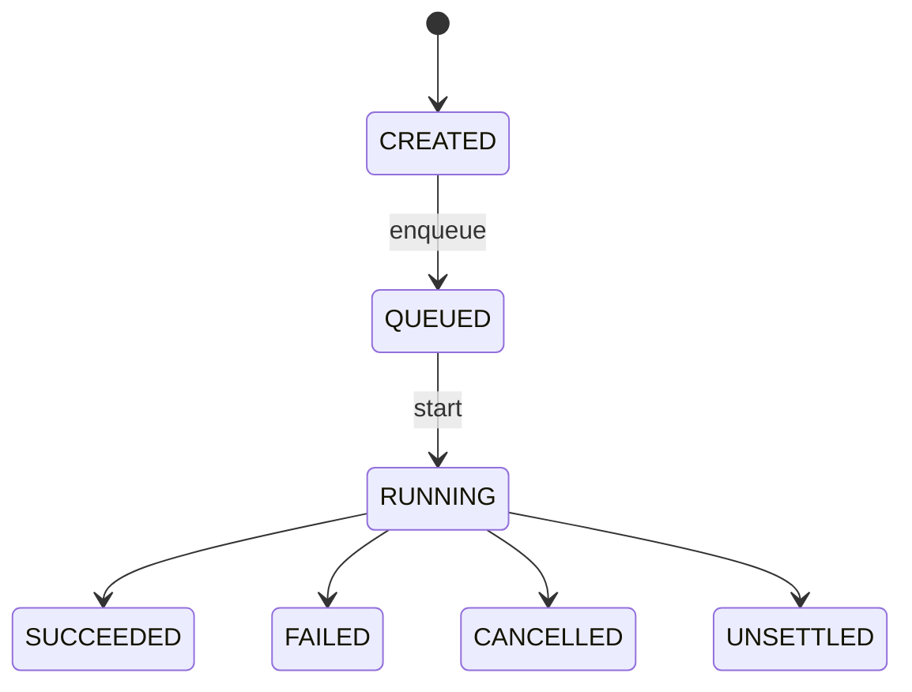
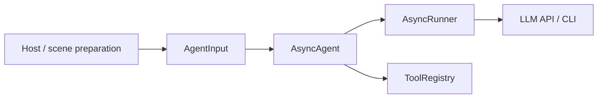
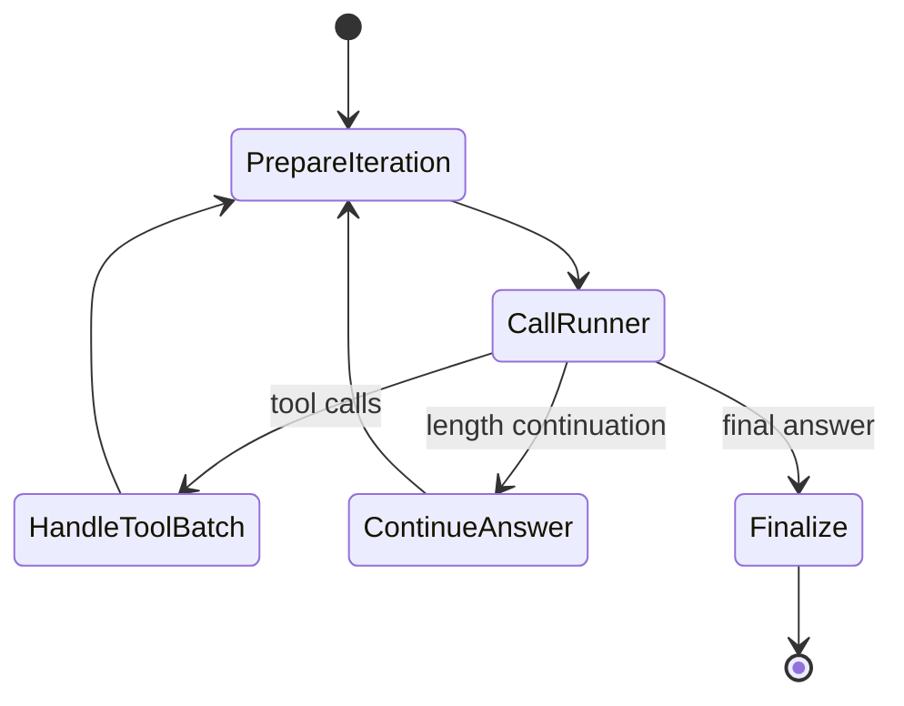
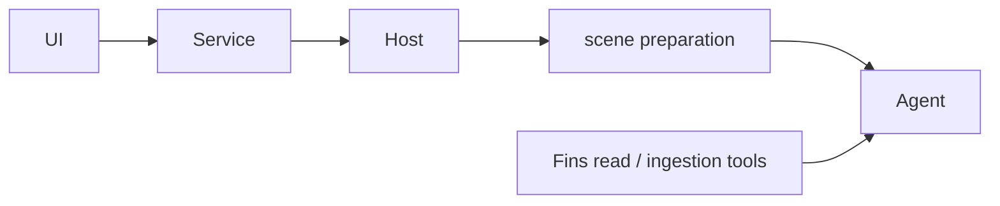
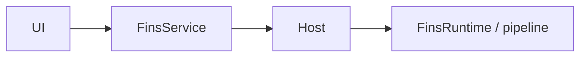

# dayu-agent CodiWiki 与刘成岗开发阶段分析

生成日期：2026-06-14  
研究对象：`noho/dayu-agent` 总览手册、Host / Engine / Fins / Config 手册、贡献指南，以及本仓库既有《刘成岗近两年 dayu agent 与 AI coding 开发路线图》。  
文档性质：代码维基 + 综合分析。  

## 0. 前提审查与证据边界

### 0.1 已确认事实

- `dayu-agent` 用户手册把项目定义为“每个投资者的助理分析师”，面向买方财报分析，不是简单功能拼装；核心表述是把 AI 读财报从整份财报“大海捞针”改为“按图索骥”，并让数据、结论、报告可审计、可追踪。
- `dayu/README.md` 明确当前稳定架构是四层：`UI -> Service -> Host -> Agent`；展开执行过程是 `UI -> startup preparation -> Service -> Contract preparation -> Host -> scene preparation -> Agent`。
- Host 手册把 Host 定义为“多会话、多租户、可中断、可恢复、可治理”的运行时底座。
- Engine 手册把 `dayu/engine` 定义为通用执行原语层，只负责把准备好的一次 Agent 消息交互稳定跑完，不理解业务语义，不读取配置，不渲染 prompt。
- Fins 手册把 `dayu/fins` 定义为证券财报领域包，不是系统基础设施，也不是架构层级；它参与 Agent augmentation path 和 direct operation path 两条路径。
- Config 手册明确配置有两层：包内默认配置 `dayu/config/` 与运行时覆盖配置 `workspace/config/`；优先读取 workspace 配置。
- 贡献指南要求先从第一性原理说明问题和目标，root cause 必须与逻辑或数据同源，严格遵守 `UI -> Service -> Host -> Agent` 分层。

### 0.2 当前材料中的不一致

- 根目录用户手册写“Web UI 已支持自选股、财报下载和交互式分析，仍处于早期阶段”；`dayu/README.md` 写“Web UI 目前仍只有 FastAPI 骨架”。这不是本文可自行裁决的代码事实；本文只记录为“公开文档存在状态描述不一致”，不据此推断 Web 当前真实完成度。

### 0.3 分析边界

- “CodiWiki”在本仓库没有现成模板；本文按“可维护代码知识库”处理，覆盖模块职责、数据流、契约、状态机、扩展点和开发阶段推断。
- “开发阶段安排”不是作者正式公开的路线图，本文依据手册当前结构、前一份路线图文档和可见工程状态做推断，并明确区分事实与推断。

## 1. 一句话理解 dayu-agent

dayu-agent 不是“LLM 外面套一层工具调用壳”，而是一个把买方财报分析问题拆成四个层次的工程系统：

1. `Service` 理解业务：用户要分析什么、写什么、下载什么、问什么。
2. `Host` 管理执行：会话、运行、并发、取消、恢复、事件、投递、记忆。
3. `Agent` 执行消息交互：消费最终 prompt/messages/tools，并和模型交互。
4. `Fins` 提供证券财报领域能力：下载、上传、处理、检索、读取财报文档。

核心设计不是“让模型更聪明”，而是“让模型只在被宿主、模板、工具、权限、数据源和状态机约束后的空间里工作”。

## 2. 架构总览

### 2.1 稳定分层

稳定含义：

- `UI` 是 composition root，只构造 Request DTO、注入窄依赖、渲染结果。
- `Service` 是唯一允许理解业务语义的一层。
- `Host` 只做托管执行，不解释财报、不决定业务动作。
- `Agent` 只消费最终 messages、工具、预算、取消信号和 trace 上下文。

### 2.2 实际执行链路

关键点：

- `startup preparation`、`Contract preparation`、`scene preparation` 都不是新架构层，只是装配阶段。
- `prompting/` 不是新层，是 Host / Service 复用的 prompt 渲染公共能力。
- `ticker` 不会直接传给 Agent，也不会进入 Host Session / Run 的结构化字段；它由 Service 解释后降解为 Prompt Contributions。
- `model_name` 也不会原样传给 Agent；它先进入 Service 的 execution options，再收敛为 accepted execution spec，最后由 Host 装配成 `AgentCreateArgs`。

## 3. 核心数据契约

### 3.1 UI -> Service：Request DTO

Request DTO 只回答“用户这次显式提交了什么”。

典型字段：

- 用户文本：`user_text`
- 领域参数：`ticker`
- 会话参数：`session_id`、`session_resolution_policy`
- 执行参数：`model_name`、`temperature`、`max_iterations`、`tool_timeout_seconds`
- 工具配置：`toolset_configs` 及请求层稀疏覆盖

边界：

- 客户端错误必须在返回 submission 句柄前失败，例如空输入、非法 scene、direct operation 空 ticker。
- UI 不先创建 Host session；`chat` / `prompt` / `fins` 对 UI 返回 submission 句柄。

### 3.2 Service -> Host：Execution Contract

Execution Contract 是 Service 已经做出的执行决策，不是 Host 再次理解业务的入口。

它回答四个问题：

- 这次执行要跑哪个 `scene`
- Host 如何托管执行
- scene preparation 需要哪些已解析装配信息
- Host 应基于哪些已接受执行规格继续机械装配

核心字段：

- `service_name`
- `scene_name`
- `host_policy`
- `preparation_spec`
- `message_inputs`
- `accepted_execution_spec`
- `metadata`

关键边界：

- `host_policy` 描述 session、并发 lane、timeout、是否 resumable。
- `preparation_spec` 描述工具集合、动态权限、Prompt Contributions。
- `accepted_execution_spec` 是模型选择、运行参数、工具配置、trace / memory 等基础设施配置的收敛结果。
- `metadata` 是 `ExecutionDeliveryContext`，只能承载投递坐标，不能塞业务参数。

### 3.3 Host -> Agent：Agent Input

Agent Input 是 Host 内部最低可执行输入，不作为 Engine 对外公共接口。

它回答四个问题：

- 最终 system prompt 和 messages 是什么。
- 最终可用工具集合是什么。
- Agent 按什么运行参数创建。
- Host 要把哪些 session state、trace、取消上下文交给 Agent。

边界：

- Agent 不解释 Request DTO。
- Agent 不解释 Execution Contract。
- Agent 不读取 `run.json` / `llm_models.json`。
- Agent 不理解 scene、ticker、文档范围、写作阶段。

## 4. Host 知识库

### 4.1 Host 定位

Host 位于 Service 和 Agent 之间：

- 对上暴露“会话 + 运行 + 回复投递”的稳定门面。
- 对下提供受托执行环境：准备输入、下发 run、收集事件、落库、兜底清理。
- 不做业务决策，不拼 UI 回复，不直接与 LLM 交互。

Host 的本质是运行时底座，而不是 Agent 包装器。

### 4.2 九项稳定能力

Host 对外承担九项能力：

| 能力 | 要解决的问题 |
|---|---|
| Session 管理 | 会话创建、确认、关闭、列举，保护所有依赖 session 的写入路径 |
| Run 生命周期 | 创建、查询、取消、订阅事件、终态落库 |
| 并发治理 | 按 lane 限制并发，支持多 lane 原子申请 |
| 事件发布 | 订阅 run / session 事件流 |
| Timeout 控制 | 到点触发 cancel |
| Cancel 控制 | 区分取消意图与取消终态 |
| Resume | pending turn lease 重发用户轮 |
| 多轮会话托管 | Pinned State + 单总池 + Raw Transcript |
| Reply outbox | 出站回复至少一次、幂等、可重试 |

Host 手册还列出 Agent replay。它与九项能力一起说明：Host 已经超出“单次请求 runner”，进入“长期运行时治理”阶段。

### 4.3 Session 状态机

实际状态还包含 `CLEARING`、`CLEARING_FAILED`。稳定契约是：所有依赖 session 的写入路径必须经过活性屏障；关闭顺序必须先 CLOSED，再批量 cancel active run，再清扫 pending turn / reply outbox。

### 4.4 Run 状态机

关键语义：

- `FAILED` 是正常代码路径中的业务失败。
- `UNSETTLED` 是 owner process 消失后的 orphan 吸收态。
- `CANCELLED` 必须区分 `USER_CANCELLED` 与 `TIMEOUT`。
- 取消有两层：`CancellationToken` 代表取消意图，Run state 落库代表取消终态。

### 4.5 Pending turn 与 resume

Pending turn 记录“用户输入已到 Host，但 Agent 尚未稳定完成”的中间状态，是 resume 能力的底座。

核心状态：

- `ACCEPTED_BY_HOST`
- `PREPARED_BY_HOST`
- `SENT_TO_LLM`
- `RESUMING`

关键机制：

- `acquire_resume_lease` 必须是 CAS 原子操作。
- `attempt_count < max_attempts` 是硬门槛，默认 3 次。
- `resume_lease_id` 是 fence token，用于阻止旧 resumer 迟到写入覆盖新 holder。
- 长尾 pending turn 最终由保留期兜底删除；正常恢复路径靠 UI 通道在自然触发点自动 resume。

### 4.6 Reply outbox

Reply outbox 解决“系统内部生成了 final answer，但外部渠道是否可靠收到”的问题。

状态：

- `PENDING_DELIVERY`
- `DELIVERY_IN_PROGRESS`
- `DELIVERED`
- `FAILED_RETRYABLE`
- `FAILED_TERMINAL`

关键不变量：

- `delivery_key` 做幂等。
- `lease_id` 做 claim / ack / nack 的 fence token。
- 下游真正确认收下后才能 mark delivered。
- Host internal success 不会自动写 outbox；是否投递由 Service 显式决定。

### 4.7 多轮记忆

多轮会话不是简单回放所有历史消息，而是三层：

| 层 | 作用 |
|---|---|
| Pinned State | 会话级反幻觉锚点，如当前目标、已确认对象、用户约束、未决问题；不参与 token 池竞争 |
| 单总池 | 最近 raw turn、更老 raw turn、episode summaries 按预算混合回放 |
| Raw Transcript | 完整原始日志，审计和回放用，永不物理删除 |

这说明 dayu-agent 对上下文窗口的处理不是“多塞历史”，而是把“可持续对话”作为运行时治理问题处理。

## 5. Engine 知识库

### 5.1 Engine 定位

`dayu/engine` 是通用执行原语层。

它负责：

- `AsyncAgent`
- `AsyncRunner`
- `ToolExecutor` / `ToolRegistry`
- `StreamEvent`
- tool loop 与工具结果回填
- 上下文预算治理、截断续写、降级
- Tool Trace
- `CancellationToken`

它不负责：

- 读取配置
- scene 解析
- system prompt 渲染
- 模板变量替换
- ticker、写作、审计等业务语义
- session / run 生命周期治理

### 5.2 主体关系

关键术语：

- Engine 内部一次 LLM 调用加工具闭环叫 `agent iteration`。
- conversation `turn` 是 transcript / memory 中的用户轮次，不等于 Engine iteration。
- `iteration_id` 是 Engine 内部轮次唯一真源。

### 5.3 AsyncAgent

`AsyncAgent` 把多个 Runner 回合串成一次完整推理过程。

约束：

- 只消费最终 messages、工具执行器、trace 身份、run_id。
- 同一个实例不支持并发运行。
- `run_id` 不进入模型 payload。
- 提交 `final_answer` 前再次检查取消，避免同时落出“已回答”和“已取消”两个事实。

### 5.4 AsyncRunner

`AsyncRunner` 负责一次底层模型调用。

稳定生命周期：

- `AsyncRunner.close()` 是稳定契约。
- 如果 Runner 持有 HTTP session、子进程句柄或异步资源，必须通过 close 收口。
- 取消不只在 iteration 首尾观察，还必须覆盖建连、响应读取、重试 sleep、SSE 分块等待等阻塞边界。

### 5.5 ToolRegistry 与工具上下文

工具执行上下文已收敛为强类型 `ToolExecutionContext`：

- `run_id`
- `iteration_id`
- `tool_call_id`
- `index_in_iteration`
- `timeout_seconds`
- `cancellation_token`

工具配置边界：

- ToolRegistry / TruncationManager 只处理工具结果契约级截断。
- Agent 全局上下文预算由 `dayu.engine.context_budget` 处理。
- doc 工具白名单解析属于 doc toolset 自身边界；Host 只能传通用 workspace 和 execution permissions。

### 5.6 Engine 状态机

失败保护：

- 连续多个 iteration 的工具批次全部失败时，按 `fallback_mode` 提前进入 `raise_error` 或 `force_answer`。
- 达到最大工具轮次后，Engine 可临时禁用工具并要求直接回答。

## 6. Fins 知识库

### 6.1 Fins 定位

`dayu/fins` 是证券财报领域包。它不是系统基础设施，也不是额外架构层级。

它有两条稳定路径：

第一条是 Agent augmentation path，Fins 提供财报工具和 Service 辅助查询。第二条是 direct operation path，覆盖 download、upload、process 等不经过 Agent 的长事务。

### 6.2 FinsToolService

`FinsToolService` 是财报文档读取能力统一入口。

它收敛：

- company 仓储
- source 仓储
- processed 仓储
- processor 路由
- 工具返回语义

目的：

- 在线工具调用和离线快照导出使用同一套文档存取与处理真源。
- `Processor.read_section()` 的稳定返回真源是 `SectionContent`。
- 财务报表处理器返回必须满足完整 `FinancialStatementResult` 契约。

### 6.3 FinsService

`FinsService` 是 direct operation 的 Service 层入口。

它负责：

- 命令语义
- submit 返回前的同步受理校验
- session / run 入口描述
- 把 direct operation 提交给 Host 托管

它不负责：

- 自己管理 run registry
- 自己桥接取消
- 自己处理并发 lane

### 6.4 工具注入

Fins 通过两个 registrar 向 Agent 路径注入工具：

- `register_fins_read_toolset(context)`
- `register_fins_ingestion_toolset(context)`

边界：

- Host 只按 `toolset_name -> registrar import path` 加载 registrar。
- Host 不直接 import Fins 叶子注册函数。
- Host 不从 FinsRuntime 拉总仓储对象。
- 财报读取 toolset 的限制配置由 registrar 从当前 toolset config 快照反解。

### 6.5 direct operation 与 pipeline

Fins direct operation 由 `FinsRuntime` 和 pipeline 实现。

当前关键 pipeline：

- `SecPipeline`：美股 SEC 下载、上传、处理。
- `CnPipeline`：A 股 / 港股下载、上传、处理。

分派规则：

- `NormalizedTicker.market == "US"` -> `SecPipeline`
- `NormalizedTicker.market in {"HK", "CN"}` -> `CnPipeline`
- 其它 market -> fail fast

这条分派只看 `NormalizedTicker.market`，不看 ticker 字面量模式。

### 6.6 document -> processor

读取已入库文档时，processor 分派由三键组合决定：

- `source`
- `form_type`
- `media_type`

优先级锚点：

- SEC 表单 BS 主路径，优先级 200。
- SEC 表单 edgartools 回退，优先级 190。
- SEC 通用兜底，优先级 120。
- 文档格式通用处理器如 Docling PDF、Markdown，优先级 100。

这个设计说明 Fins 的复杂度主要来自“文档来源和形态的差异”，不是来自 Agent loop 本身。

## 7. Config 知识库

### 7.1 配置层级

Dayu 有两层配置：

1. 包内默认配置：`dayu/config/`
2. 运行时覆盖配置：`workspace/config/`

优先级：

- 优先读取 `workspace/config/*`
- 缺失时回退到 `dayu/config/*`

最常改的三个位置：

- `workspace/config/llm_models.json`
- `workspace/config/run.json`
- `workspace/config/prompts/`

### 7.2 toolset_registrars.json

`toolset_registrars.json` 只声明“某个 toolset 由哪个 registrar adapter 实现”，不决定某次执行是否启用该 toolset。

是否启用工具集合由三层求交决定：

1. scene manifest 的工具候选集合
2. Service 通过 `selected_toolsets` 选择的实际工具集合
3. `execution_permissions` 动态权限

### 7.3 llm_models.json

模型配置至少包含：

- `runner_type`
- `name`
- `endpoint_url`
- `model`
- `headers`
- `timeout`
- `supports_stream`
- `supports_tool_calling`
- `max_context_tokens`
- `runtime_hints`

当前 runner 只允许 `openai_compatible`；CLI runner 已禁用。

新增模型需要三步：

1. 加入 `llm_models.json`。
2. 加入对应 scene manifest 的 `model.allowed_names`。
3. 如果长期用于 interactive 多轮，再补 `runtime_hints.conversation_memory`。

### 7.4 run.json

`run.json` 承载：

- Agent 默认运行参数。
- doc / fins / web tool limits。
- Host config。
- trace / budget 等运行时基础设施参数。

关键边界：

- `run.json` 不决定 web 工具是否进入候选集合；候选资格由 scene manifest 的 tool selection 决定。
- `web_tools_config` 只传联网执行参数，不放宽 scene / Service 已收窄的工具权限。
- `host_config.store.path` 是 Host SQLite 数据库路径；session、run、permit、pending turn 状态共享该数据库。

## 8. 贡献与开发纪律

贡献指南的核心不是“怎么提交 PR”，而是约束开发方式：

- 先从第一性原理说明问题和目标。
- root cause 必须与逻辑或数据同源，禁止间接证据拼结论。
- Dayu 是宿主强约束下的 `LLM in the loop`，不是 `LLM on the loop`。
- Host 是 Agent / AsyncAgent / AsyncOpenAIRunner 生命周期、取消、治理的强约束真源。
- 严格遵守 `UI -> Service -> Host -> Agent`。
- 禁止反向依赖。
- 下层接口设计必须假设上层不存在，只考虑上层调用需求，不向上泄漏实现细节。
- 财报文档存取必须且只能通过 `dayu.fins.storage` 下的仓储协议与实现完成。
- 写作链路优化目标是更好的买方分析报告，不是更容易通过 audit。

这套纪律与刘成岗公开发帖中的 AI coding 观点一致：AI 可以快速实现，但复杂系统必须靠明确边界、root cause、测试和文档来约束。

## 9. 第一性原理分析：为什么 dayu-agent 必须长成这样

### 9.1 原问题不是“问答”，而是“可信投研生产”

如果目标只是问答，一个薄壳 Agent 就足够。但买方财报分析要求：

- 数字有来源。
- 结论可复核。
- 报告可追踪。
- 长文档不能遗漏关键章节。
- 多轮对话不能丢失已确认事实。
- 长事务不能因为进程退出、网络波动、timeout 而失去状态。

所以系统必须把问题拆成三类真源：

- 业务真源：Service 决定业务意图。
- 执行真源：Host 决定 run 是否完成、是否可恢复、是否取消。
- 数据真源：Fins storage / processor 决定文档读取和结构化数据。

### 9.2 为什么要先模板，再 Agent

事实依据：前一份路线图记录了“公司定性分析全貌梳理（纯网页 ChatGPT 工作流）”和“公司全貌分析加工流程（端到端）”阶段；dayu-agent 当前仍把“定性分析模板机械感强、需写出差异化”列为可参与方向。

推断：模板先于大规模工程化。

理由：

- 没有模板，就不知道报告应回答哪些问题。
- 没有章节和证据约束，就无法定义工具要读哪些 section。
- 没有人工工作流验证，自动化会把错误流程放大。

置信度：高。

### 9.3 为什么 AsyncAgent 可以先做，但不能停在那里

事实依据：Engine 当前已是独立通用执行原语层；它不理解业务、不读配置、不管理 run 生命周期。

推断：AsyncAgent 是早期必要底座，但很快被 Host / Scene / Service 包住。

理由：

- 单个 `AsyncAgent` 解决的是“一次消息交互怎么跑完”。
- dayu-agent 真正的问题包括多会话、恢复、取消、投递、长事务、文档仓储、跨 UI 渠道。
- 这些都不是 Engine 应该解决的职责。

置信度：高。

### 9.4 为什么 Fins 会成为最大的复杂度中心之一

事实依据：Fins 手册篇幅长，覆盖 Agent augmentation、direct operation、SecPipeline、CnPipeline、6-K 规则诊断、document -> processor 分派、仓储与处理器契约。

推断：Fins 的复杂度不是后期装饰，而是 dayu-agent 能否成立的核心瓶颈。

理由：

- 投研质量首先受输入质量限制。
- PDF / HTML / SEC / 巨潮 / 披露易 / 10-K / 20-F / 6-K / A/H 股材料差异巨大。
- 如果文档读取不稳定，Agent 层再强也只会稳定地产生不可审计输出。

置信度：高。

### 9.5 为什么 Host 在中后期被大幅强化

事实依据：Host 手册中存在 session、run、pending turn、reply outbox、并发 lane、取消桥、deadline watcher、two-layer memory、lease fence token、orphan cleanup 等大量稳定契约。

推断：Host 强化不是最早阶段的产物，而是从单次 Agent 调用走向多 UI、多会话、可恢复运行后逐步长出来的。

理由：

- 如果只做 CLI 单次 prompt，不需要 reply outbox。
- 如果没有多轮和掉线恢复，不需要 pending turn lease。
- 如果没有并发长事务和模型 API 压力，不需要 lane governor 与 `llm_api` 自治 lane。
- 如果没有 UI 渠道差异，不需要把 internal success 与外部投递成功分离。

置信度：中高。不能从当前文档直接证明具体时间顺序，但从依赖关系和问题必要性看，该阶段不可能早于基础 Agent / Fins 能力。

### 9.6 为什么 Config / Scene 是后续扩展的核心

事实依据：Config 手册把模型、run、prompts、toolset registrars、scene manifest、runtime hints、tool limits、Host config 分开；scene 负责 prompt 片段装配、context slot、模型 allowlist、工具候选集合。

推断：当系统从单一写作工具扩展到 prompt / interactive / write / audit / repair / confirm 等多个 scene 后，配置和 scene manifest 成为避免硬编码扩散的关键。

理由：

- 不同 scene 对模型、温度、工具、迭代次数、上下文预算要求不同。
- 如果这些逻辑写死在 Service 或 Engine 中，会破坏边界并导致改一个场景影响全局。
- scene manifest 让“可变策略”留在配置层，Engine 保持通用，Service 保持业务解释。

置信度：高。

## 10. 推断的开发阶段安排

以下阶段是综合公开发帖路线图与当前手册结构后的推断，不是作者发布的正式计划。

### 阶段 1：投研任务定型

目标：定义“买方分析报告到底要回答什么”。

主要工作：

- 公司定性分析模板。
- 章节结构。
- 证据优先级。
- 不允许模型凭常识补数字。
- 人工网页 ChatGPT 工作流验证。

判断依据：

- 路线图文档记录了纯网页 ChatGPT 工作流。
- 当前 README 仍把模板差异化作为项目可参与方向。

工程含义：

- 先确定输出标准，再自动化。
- 先验证认知框架，再写系统。

### 阶段 2：端到端流程雏形

目标：把人工工作流拆成可执行步骤。

主要工作：

- 从 ticker / 年报输入开始。
- 提取年报 section。
- 按模板章节匹配材料。
- 控制 token 消耗。
- 形成“公司全貌分析加工流程”。

判断依据：

- 路线图文档记录了端到端加工流程。
- dayu 当前主链仍强调 ticker 不直达 Agent，而是由 Service 解释为 Prompt Contributions。

工程含义：

- 业务语义在 Service，而不是 Agent。
- ticker 是业务线索，不是模型参数。

### 阶段 3：AsyncAgent / Engine 底座

目标：让 LLM 能稳定执行多轮工具调用。

主要工作：

- `AsyncAgent`
- `AsyncRunner`
- `ToolRegistry`
- tool loop
- 流式事件
- Tool Trace
- 上下文预算、续写、降级
- 取消观察

判断依据：

- Engine 手册列出的职责正是单次 Agent 执行原语。
- 路线图文档记录 AsyncAgent 初版两天完成。

工程含义：

- 这阶段解决“怎么跑一次 Agent”。
- 还没有解决“多会话、多渠道、可恢复、出站投递”。

### 阶段 4：Fins 数据管线和文档读取

目标：把原始披露材料变成低噪声、可读、可检索、可审计的数据。

主要工作：

- 美股 SEC pipeline。
- A 股 / 港股 pipeline。
- 下载、上传、处理 direct operation。
- source / processed / company 仓储。
- document -> processor 分派。
- 6-K 规则诊断。
- Docling / HTML / edgartools 等处理路径。

判断依据：

- Fins 手册大量篇幅用于 pipeline、processor、仓储、诊断闭环。
- 路线图文档记录财报读取能力耗时远超 AsyncAgent 初版。

工程含义：

- dayu-agent 的护城河不是 LLM 调用，而是财报数据进入 LLM 前的处理质量。

### 阶段 5：Host 运行时治理

目标：把单次 Agent 运行升级成可运营的系统。

主要工作：

- Session / Run 状态机。
- 并发 lane。
- timeout / cancel。
- pending turn / resume。
- reply outbox。
- two-layer memory。
- orphan cleanup。
- delivery key / lease fence token。

判断依据：

- Host 手册中这些机制已形成稳定契约。
- 这些能力都服务于多会话、多渠道、长事务和可靠运行。

工程含义：

- 这阶段解决“系统怎么长期稳定跑”。
- 它把 AI coding 产出的功能代码收束为可治理运行时。

### 阶段 6：Scene / Config / Prompt 治理

目标：把场景差异、模型差异、工具差异从代码里抽出来。

主要工作：

- scene manifest。
- prompt assets。
- model catalog。
- execution options。
- toolset registrars。
- run.json tool limits。
- memory policy。

判断依据：

- Config 手册明确模型接入要同时修改 `llm_models.json`、scene manifest、必要时 runtime hints。
- 总览手册明确 scene 是声明式执行策略，不是业务解释层。

工程含义：

- 新增模型、新增工具、新增场景不应改 Engine。
- Service 决定业务，scene 声明执行策略，Host 机械落实。

### 阶段 7：产品入口和可靠交付

目标：把能力暴露给不同用户入口。

主要工作：

- CLI。
- Web / FastAPI。
- WeChat。
- 渲染 HTML / PDF / Word。
- reply outbox 和渠道投递。

判断依据：

- 用户手册列出 prompt、interactive、微信、write、render。
- Host 手册把出站投递作为独立真源。

工程含义：

- UI 不是直接套 Agent；每个入口都必须通过 Service / Host 稳定契约。
- 渠道成功收到回复和 Host 内部执行成功是两件事。

### 阶段 8：当前开放问题与后续方向

当前手册列出的未完事项：

- 定性分析模板仍机械，行业差异和公司特异变量不足。
- Engine web tools 对抗 challenge 能力弱。
- GUI 未实现。
- Web 状态文档存在不一致，需要以代码核验。
- WeChat 仍有更多功能空间。
- 财报电话会议记录转录与信息提取未实现。
- 财报 presentation 信息提取未实现。
- Anthropic 原生 API 支持未完成。
- Durable memory / Retrieval layer 未完成。
- FMP 工具未实现。
- 普通文件信息提取仍需优化。

推断：dayu-agent 已过“能跑 demo”的阶段，当前主要矛盾从“有没有 Agent”转向“报告质量、数据质量、运行可靠性、入口完整性和扩展生态”。

置信度：高。

## 11. 事实与观点分离表

| 条目 | 类型 | 依据 | 置信度 |
|---|---|---|---|
| dayu-agent 定位为买方财报分析 Agent | 事实 | 根目录 README | 高 |
| 稳定架构是 `UI -> Service -> Host -> Agent` | 事实 | `dayu/README.md` | 高 |
| Host 是运行时治理底座 | 事实 | Host 手册 | 高 |
| Engine 不理解业务语义 | 事实 | Engine 手册 | 高 |
| Fins 是领域包，不是架构层 | 事实 | Fins 手册 | 高 |
| 开发先从模板和人工工作流开始 | 推断 + 路线图佐证 | 路线图文档、README 未完事项 | 高 |
| Fins 数据管线是核心瓶颈 | 推断 | Fins 手册复杂度、路线图财报读取成本 | 高 |
| Host 强化发生在基础 Agent / Fins 后 | 推断 | 功能依赖关系 | 中高 |
| Scene / Config 是多场景扩展后的治理产物 | 推断 | Config / Scene 手册 | 高 |
| 当前 Web UI 真实完成度 | 未裁决 | 根 README 与 dayu/README 描述冲突 | 低 |

## 12. 资料索引

- dayu-agent 根目录用户手册：<https://github.com/noho/dayu-agent>
- 总览开发手册：<https://github.com/noho/dayu-agent/blob/main/dayu/README.md>
- Host 手册：<https://github.com/noho/dayu-agent/blob/main/dayu/host/README.md>
- Engine 手册：<https://github.com/noho/dayu-agent/blob/main/dayu/engine/README.md>
- Fins 手册：<https://github.com/noho/dayu-agent/blob/main/dayu/fins/README.md>
- 配置手册：<https://github.com/noho/dayu-agent/blob/main/dayu/config/README.md>
- 贡献指南：<https://github.com/noho/dayu-agent/blob/main/CONTRIBUTING.md>
- 本仓库路线图文档：`docs/liu-chenggang-dayu-ai-coding-roadmap-20260614.md`
